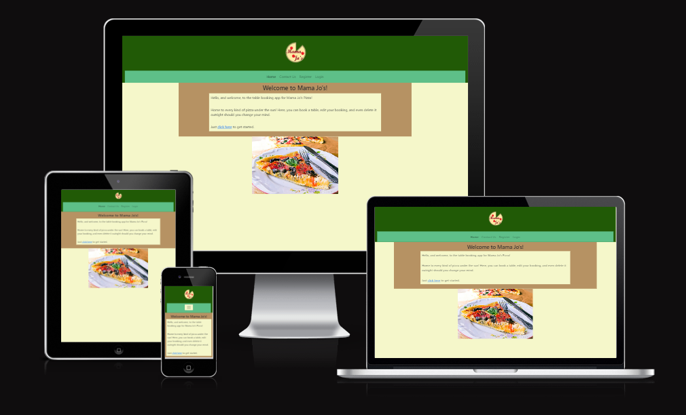
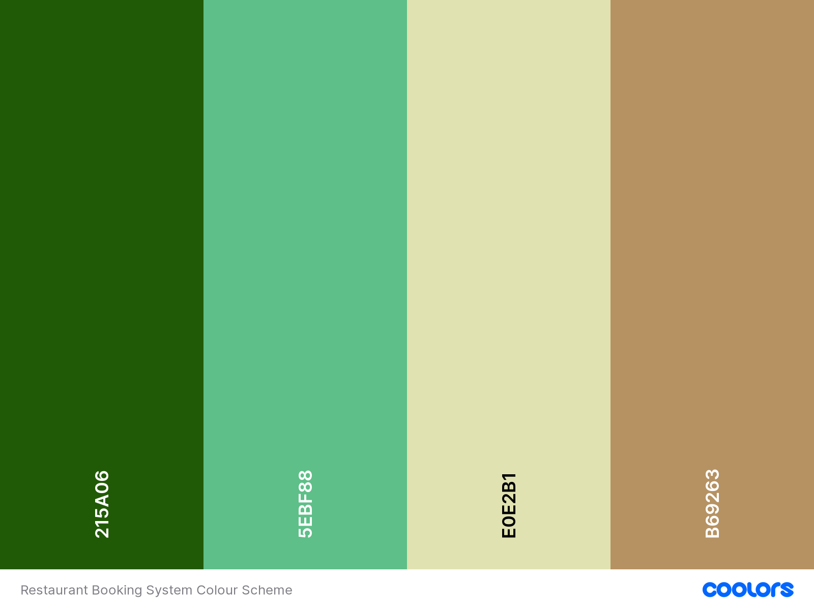
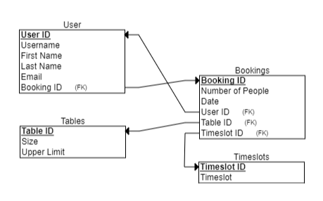
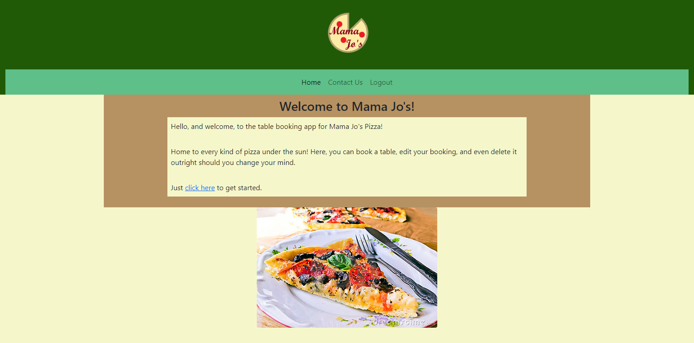
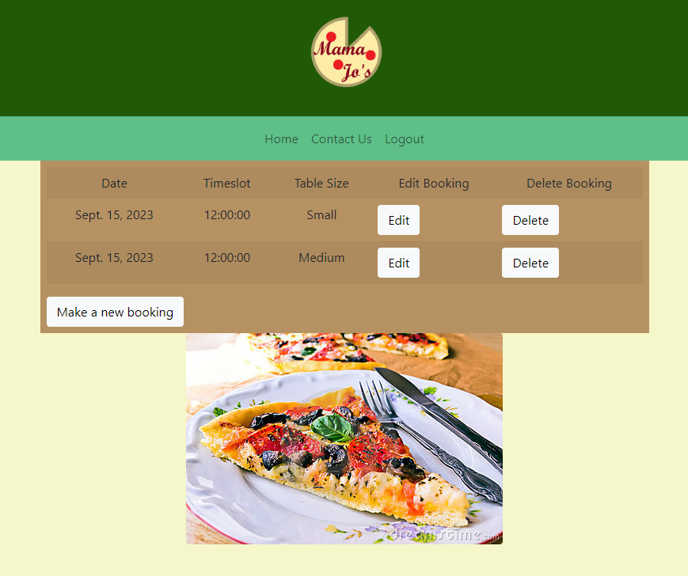
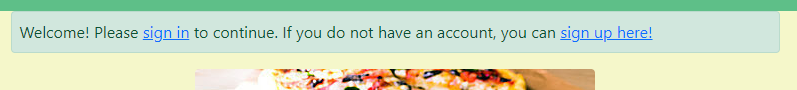
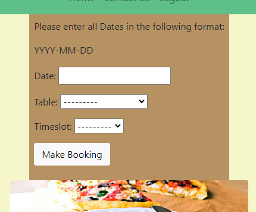
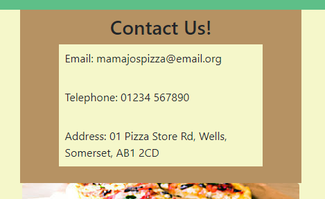

# Project 4: Restaurant Booking System

The Mama Jo's Booking Site is designed to be a responsive website that allows customers of the Mama Jo's Pizza Restaurant to view the site across a range of devices so that they can book tables at said restaurant ahead of time.

Link to the site here: https://project-4-restaurant-booking.herokuapp.com/

---

## CONTENTS

* [User Experience](#user-experience-ux)
  * [User Stories](#user-stories)

* [Design](#design)
  * [Colour Scheme](#colour-scheme)
  * [Imagery](#imagery)
  * [Wireframes](#wireframes)

* [Features](#features)
  * [Accessibility](#accessibility)

* [Technologies Used](#technologies-used)
  * [Languages Used](#languages-used)
  * [Frameworks, Libraries & Programs Used](#frameworks-libraries--programs-used)

* [Deployment & Local Development](#deployment--local-development)
  * [Deployment](#deployment)
  * [Local Development](#local-development)
    * [How to Fork](#how-to-fork)
    * [How to Clone](#how-to-clone)

* [Testing](#testing)

* [Credits](#credits)
  * [Code Used](#code-used)
  * [Content](#content)
  * [Media](#media)
  * [Acknowledgments](#acknowledgments)

---

## User Experience (UX)

### Initial Discussion

Mama Jo's Booking Site is an online service designed to allow users to book tables at the Mama Jo's Pizza Restuarant ahead of time. Users with accounts can see any and all bookings they have made, can make new bookings, and can edit or even delete existing bookings if they should so desire.

#### Key information for this site

* How to sign up or sign in to the site.
* How to book tables for yourself.
* A way for people to contact the Restaurant with queries or feedback.

### User Stories

#### Client Goals

* To be able to view the site on a range of device sizes.
* To make it easy for potential customers to sign up to and make use of the site's services.
* To allow people to be able to contact the Restaurant with questions or to report problems.

#### New Customer Goals

* I want to easily sign up to and make use of the site's services.
* I want to quickly and easily search for available tables.
* I want to be able to access other sites or socials linked to the Restuarant so as to learn more about them.

#### Returning Customer Goals

* I want to be able to see, alter, or even cancel any existing bookings. 
* I want to be able to specify all relevant details while booking in order to quickly book specific tables.
* I want to be able to contact the Restaurant to report any problems that might occur.

## Design

### Colour Scheme

The website uses a palette colours inspired by other Italian Restaurants. The colour palette was created using the [Coolors](https://coolors.co/) website, and has been kept to almost excusively, with only one exception: the vanilla colour was replaced with cream - #F5F7CA to be exact - as it was found to be more appealing in practice.

### Imagery

I have only used two images throughout the entire site, although they are present on the Home, Bookings, and Contacts pages. One is a custom logo for the Restaurant, and the other is a free to use and share picture of pizza. I have credited the latter in the [credits](#Credits) section.

### Wireframes

The only major wireframe used in this site was for the database, specifically an example diagram used to better envision what kind of database I intended to set up.

Obviously the User section is only there to help me better envision how I wanted to set up the database, and I chose in the end to remove the "number of people" option entirely, as it was largely unnecessary due to the existance of the Table Size attribute, but the diagram otherwise perfectly covers the database that was implemented.

## Features

The website is composed of five pages, two of which are accessible from the navigation menu (Home page and Contacts page). The remaining three are the Index page, where the user can view and delete their existing bookings if they should have any, the Bookings page, where the user can make a new booking, and the Edit page, where the user can edit the details of a chosen booking.

* All pages on the website have the following:

  * A header containing a responsive navigation bar and restaurant logo. The navbar allows the user to navigate through the site. When viewing on mobile devices, the navigation links change to a burger toggler, so as to make the site look cleaner on such devices and to promote good UX design.

  * A Pizza image at the bottom of the site, to improve the aesthetcs and make to site feel more welcoming.

* The Home page excusively features a simple welcoming message, which informs the user of the site's purpose, as well as how to use its services. It also features links to the Index page.

* The Index page excusively features a table containing all bookings the user has made, if they have made any, as well as a button to take them to the Bookings page in order to make new bookings. If the user has made any bookings, then this page also features two buttons by every booking: the edit button, which takes the user to the Edit page so they can edit the booking, and the delete button, which permanently deletes the booking in question.

  * All of the above is only viewable on the Index page if the user is signed in. If they are not, they are instead informed that they need to sign in or sign up to continue, and provides links to do either action.

* The Bookings page exclusively features a simple form for the user to fill out, allowing the user to choose the date, time, and preferred table for their booking. If the chosen table is not available at that time on that day, the booking is not made and the user is informed by an alert that this is the case. If instead the table is available, then the booking is added to the database and the user is redirected back to the Index page.

* The Edit page is for all intents and purposes identical to the Bookings page, except the form has already been filled out with the original details of the booking being edited. Should the new booking be unavailable in the same manner as one made on the Booking page, and alert will inform the user that this is the case without overwriting the old booking. If it is valid, then the old booking is replaced with the new one, and the user is again redirected back to the Index page.

* The Contacts page, much like the Home page, features only text, this time containing the email, phone number, and address of the Restuarant so that it can be contacted should the need arise.

### Accessibility

I have been mindful during coding to ensure that the website is as accessible as possible. I have achieved this by:

* Using semantic HTML.
* Using descriptive alt attributes on images on the site.
* Ensuring that there is a sufficient colour contrast throughout the site.
* Ensuring the nav menu is accessible by marking the current page as active for the user if it is on the navbar.
* Ensuring that the elements on the site adapt and change with the screen size.

## Technologies Used

### Languages Used

HTML, CSS, JavaScript and Python were used to create this website.

### Frameworks, Libraries & Programs Used

Git - For version control.

Github - To save and store the files for the website.

Bootstrap Version 5 - The styling framework for the website. Styling for the almost everything in the website came from here. Additional CSS styling was also implemented in the style sub-element of the head element in the site_page.html file.

Google Fonts - To import the fonts used on the website.

Django v3 - The main framework for the website. The code for the database, user authentication and authorisation, and even the form came from here.

[Am I Responsive?](http://ami.responsivedesign.is/) To show the website image on a range of devices.

## Testing

You can see the information on testing [here](TESTING.md)

## Credits

### Code Used

I borrowed the initial code for the navbar from the "I Think Therefore I Blog" Walkthrough Project, solely to acquire the raw functionality of both the navbar itself as well as the login/logout/register functionality as quickly as possible. I also did the same for the Bootstrap links, for the same reason.

### Content

I made the site for a theoretical client. The client was modelled off of what I envisioned a restuarant owner who wished to create a seperate site solely to handle table bookings might want, and used to dictate what content should or should not be pursued, alongside User Stories for theoretical New and Returning Customers.

###  Media

There are only two images used in my site. The first is the logo at the top of every page. As this image was created by me, there is no source to give. The second is the pizza image at the bottom of every page, which I acquired from searching for images on Bing with the 'Free to search and use' filter active. The link to it is here: [Pizza Image](https://yanzap.blogspot.com/2011/09/pizza-time.html)
  
###  Acknowledgments

I'd like to thank my mentor Jubril Akolade for being of incredible help. Thanks to him, I was able to gain access to the User authentication pages templates. Unfortunately, I do not have the time to implement and alter them, which is why such has not yet occured, much to my chagrin. Still, it is thanks to my mentor sessions with him that I was able to maintain my determination that in spite of the relatively lacking time I had left, I could still complete the project.

I would also like to thank my fellow programmers on Slack, who helped me through my problems with the deployment process, allowing me to finally finish this project.